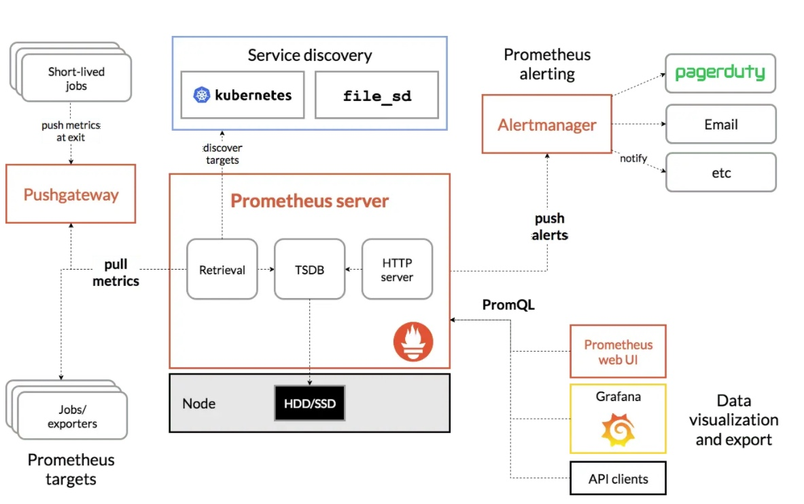
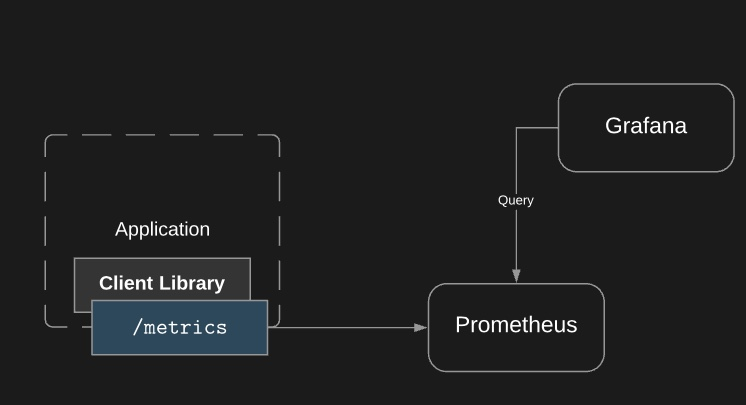
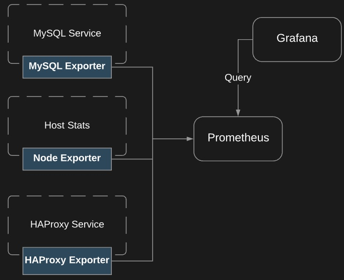
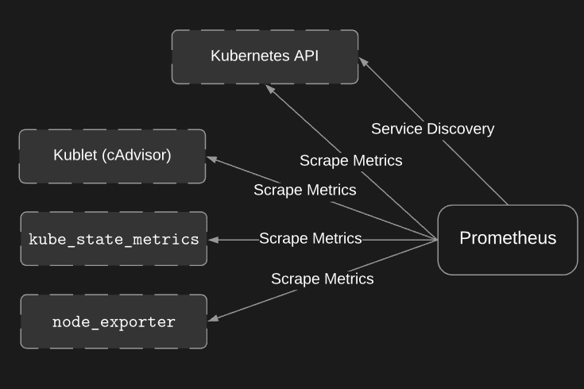

# Prometheus Architecture

## Client Library

The client library sits in the application. 

The client libaray go and gather the metrics on your applcation and format them to what prometheus can understand

## Exporters

We use exporters to instrument applications which we don't have the source code for.

## Service Discovery and 

How does prometheus access to the metrics of the application? we can 
* define the target in prometheus configuration
* use service discovery

## Reference
[How to Setup Prometheus Monitoring On Kubernetes Cluster](https://devopscube.com/setup-prometheus-monitoring-on-kubernetes/)
