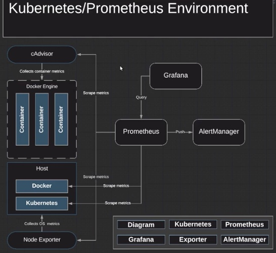

# Deploy Prometheus and Grafana Monitoring Stack  


## Prometheus
1. namespace

2. configmap
note the `node-exporter-acg-vms` wouldn't work until the NodeExporter is successfully installed in the target VMs

3. deployment

4. service

5. clusterrole

6. kube-state-metrics
kube-state-metrics (KSM) is a simple service that listens to the Kubernetes API server and generates metrics about the state of the objects


## NodeExporter
The Prometheus Node Exporter exposes a wide variety of hardware- and kernel-related metrics.
[Prometheus Node Exporter](https://github.com/prometheus/node_exporter)

How to install
```bash
sudo apt-get update
sudo apt-get install prometheus-node-exporter
```

## Grafana
1. deployment
2. service

Add data source in Grafana
[img](./img/grafana-add-data-source.jpg)

## Reference
* [How to Setup Prometheus Monitoring On Kubernetes Cluster](https://devopscube.com/setup-prometheus-monitoring-on-kubernetes/)
* [content-kubernetes-prometheus-env](https://github.com/linuxacademy/content-kubernetes-prometheus-env)